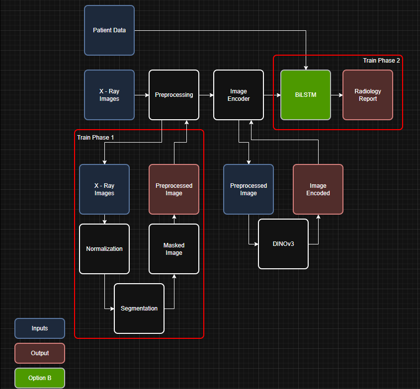

# Chest X-ray Diagnosis and Automated Radiology Report Generation - UDEM PEF-Thesis (Fall-2025)

## Project options

## Opction chosen

## [Research info](https://github.com/devMuniz02/Chest-X-ray-Diagnosis-Automated-Reporting-using-CNNs-and-LLMs---UDEM-PEF-Thesis-Fall-2025/wiki)

## References of theory
- Attention for Transformers
    - [First attention paper](https://arxiv.org/abs/1409.0473)
    - [First transformer paper](https://arxiv.org/abs/1706.03762)
- Model architectures
  - Convolutional Neural Networks
    - [ResNet](https://arxiv.org/abs/1512.03385)
    - [UNet](https://arxiv.org/abs/1505.04597)
- Techniques
  - Transfer learning
  - Visual explanations
      - [Grad-CAM](https://arxiv.org/pdf/1610.02391)
      - [Grad-CAM++](https://arxiv.org/pdf/1710.11063)

## Code

- Kaggle code example [LINK TO EXAMPLE KAGGLE NOTEBOOK](https://www.kaggle.com/code/kmader/train-simple-xray-cnn)
- My Kaggle code [LINK TO KAGGLE NOTEBOOK](https://www.kaggle.com/code/devmuiz/chest/edit)
- My Colab code [https://colab.research.google.com/drive/1umNFkP6SWtUC7W4cUycM4Cd3pHYMwLcw?usp=sharing]

## Things to watch when trainning NN
- Class imbalances
  - Test set and validation
  - Trainning class weights
- Data filtration
  - Same patient ID on same set (Train/Val/Test)
