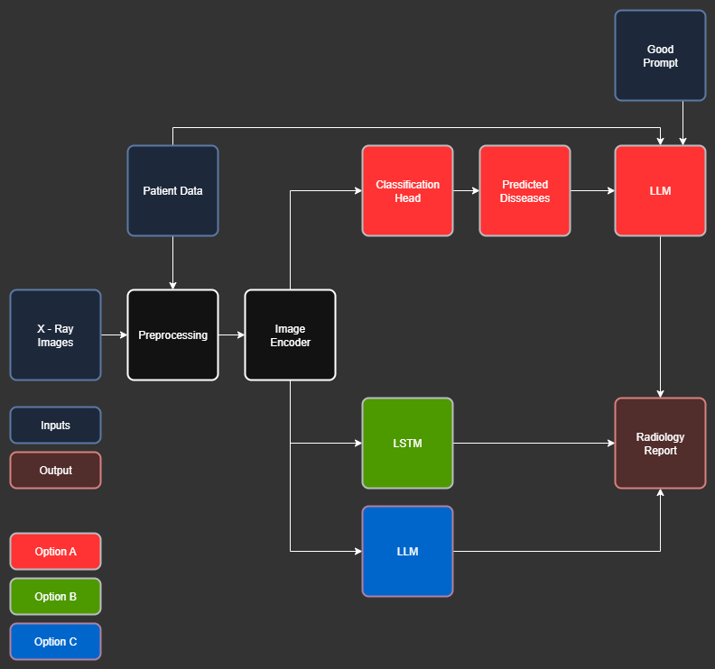
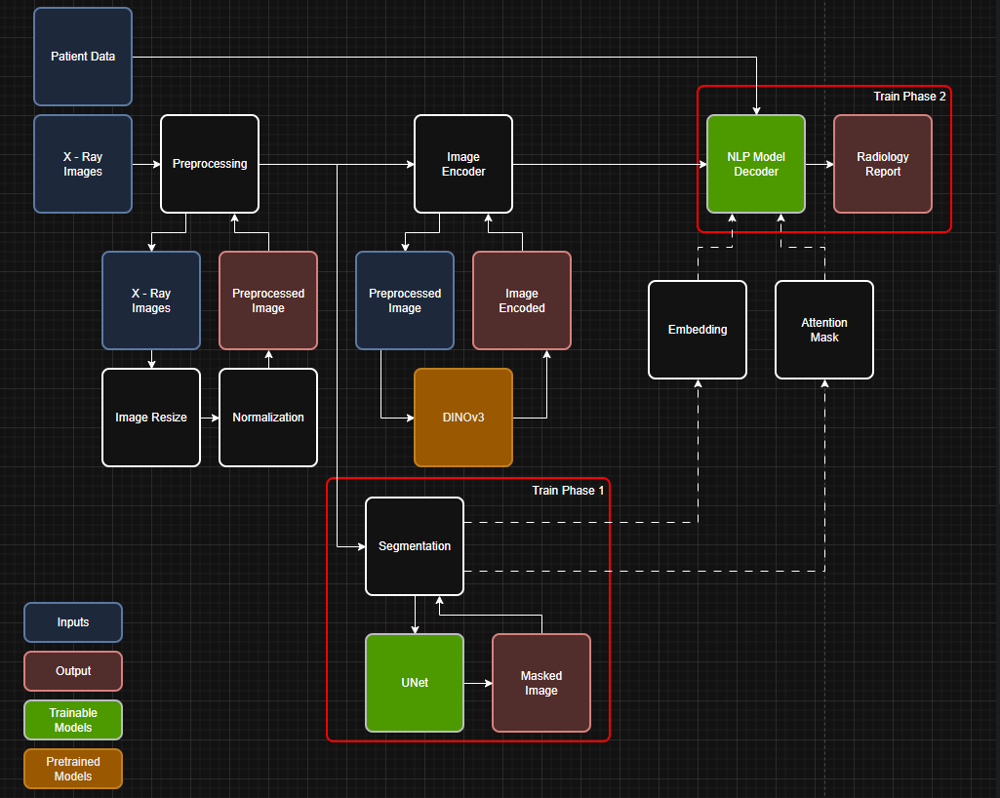

# Chest X-ray Diagnosis and Automated Radiology Report Generation - UDEM PEF-Thesis (Fall-2025)

## [Project options](https://drive.google.com/file/d/1RG4J-OJZHEcZ6JLumfA0csCI9Gp2dGzf/view?usp=sharing)

## [Option chosen](https://drive.google.com/file/d/1awiWTWzrvHGp5Se7_MCwdPbxYbsJklMg/view?usp=sharing)

## [Research info](https://github.com/devMuniz02/Chest-X-ray-Diagnosis-Automated-Reporting-using-CNNs-and-LLMs---UDEM-PEF-Thesis-Fall-2025/wiki)

## References of theory
- Attention for Transformers
    - [First attention paper](https://arxiv.org/abs/1409.0473)
    - [First transformer paper](https://arxiv.org/abs/1706.03762)
    - [First GPT model OpenAi](https://cdn.openai.com/research-covers/language-unsupervised/language_understanding_paper.pdf)
    - [GPT-2 model OpenAi](https://cdn.openai.com/better-language-models/language_models_are_unsupervised_multitask_learners.pdf)
      - [GPT-2 Model architecture](https://medium.com/%40hsinhungw/gpt-2-detailed-model-architecture-6b1aad33d16b)
      
        
- Model architectures
  - Convolutional Neural Networks
    - [ResNet](https://arxiv.org/abs/1512.03385)
    - [UNet](https://arxiv.org/abs/1505.04597)
- Techniques
  - Transfer learning
  - Visual explanations
      - [Grad-CAM](https://arxiv.org/pdf/1610.02391)
      - [Grad-CAM++](https://arxiv.org/pdf/1710.11063)

## Things to watch when trainning NN
- Class imbalances
  - Test set and validation
  - Trainning class weights
- Data filtration
  - Same patient ID on same set (Train/Val/Test)
