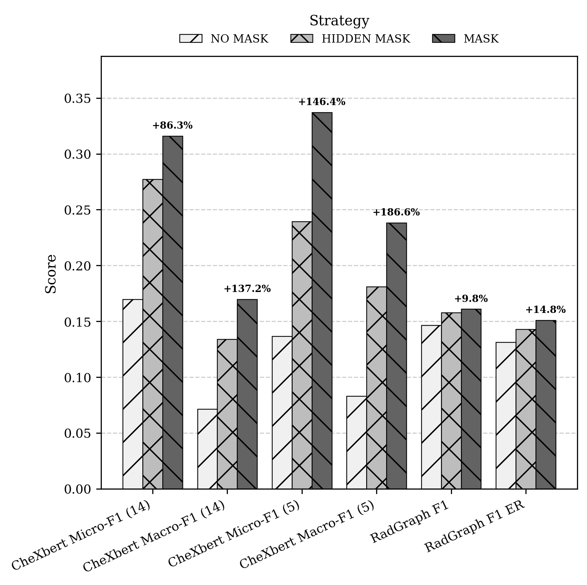

# Chest X-ray Diagnosis and Automated Radiology Report Generation - UDEM Thesis (Fall-2025)

Official repository for the UDEM Fall 2025 thesis project:

**“Automated Diagnosis and Clinical Report Generation of Thoracic Diseases Using Artificial Intelligence.”**  
**Universidad de Monterrey (UDEM)**

This project presents a multimodal architecture that combines a **DINOv3 ViT-S/16 visual encoder**, a **GPT-2 text decoder**, and a novel **layer-wise anatomical attention mechanism** to improve the generation of clinically grounded chest X-ray Findings.

---

# 🚀 Overview

This work proposes a radiology report generation model that incorporates **explicit anatomical priors** into every transformer layer of a GPT-2 decoder.  
The goal is to enhance clinical correctness, reduce hallucinations, and improve alignment between visual evidence and generated medical text.

---

# 🩺 Why Only *Findings*?

This model intentionally focuses **exclusively on generating the Findings section** of radiology reports.

This decision was made to:

- Focus the architecture on a **single, measurable task**
- Improve descriptive accuracy
- Reduce hallucinations by tying text strictly to visible structures
- Enable fair comparisons and ablation experiments
- Leverage validated clinical NLP tools (CheXbert, RadGraph, CheXpert labeler)

Findings represent the portion of the report that is **directly grounded in the image**, making them ideal for evaluating the effect of anatomical attention.

---

# 🧠 Method Summary

### **1. Visual Encoder (DINOv3 ViT-S/16)**  
Extracts global and local features from the chest X-ray image.

### **2. Anatomical Mask Construction**  
A lung–heart segmentation mask is downsampled and progressively smoothed to create a set of priors, one for each GPT-2 decoder layer.  
Early layers receive broad, diffuse masks; later layers receive more focused ones.

### **3. GPT-2 Decoder With Layer-Wise Anatomical Attention**  
At each GPT-2 layer, the anatomical prior influences the attention pattern, nudging the model to focus on clinically relevant regions.  
This improves spatial grounding and reduces inconsistent or irrelevant sentences.

### **4. Autoregressive Findings Generation**  
During inference, the model generates Findings one token at a time while anatomical priors provide consistent structural guidance.

---

# 📊 Comparison With State of the Art

This project is compared against leading radiology report generation and grounding systems, including:

- **MAIRA-2 (2024)**
- **MedPaLM-M(2023)**
- **CheXagent (2023)**

Metrics used:

- **CheXbert F1** — clinical consistency  
- **RadGraph F1** — entity + relation extraction  

### MIMIC-CXR Test Findings only  

| Metric                     | Our Model | SOTA Score | SOTA Model |
|----------------------------|---------------|-----------------|------------|
| **CheXbert F1 (Micro)**    | 38.38         | 58.1            | MAIRA-2    |
| **CheXbert F1 (Macro)**    | 19.61         | 41.6            | MAIRA-2    |
| **CheXbert F1 (Micro-5)**  | 42.93         | 59.1            | MAIRA-2    |
| **CheXbert F1 (Macro-5)**  | 31.87         | 51.6            | MedPaLM-M  |
| **RadGraph F1 (RG-E)**     | 15.83         | 34.6            | MAIRA-2    |
| **RadGraph F1 (RG-ER)**    | 13.91         | 39.6            | MAIRA-2    |


---

# 🧪 Ablation Experiments

To evaluate the impact of anatomical attention, three configurations were tested:

### **1. No Mask Added (Baseline)**  
- GPT-2 receives only visual embeddings  
- No anatomical priors  
- Standard multimodal baseline

### **2. Mask Added (Soft Anatomical Attention)**  
- Each GPT-2 layer receives its own smoothed anatomical prior  
- Encourages attention to image regions of interest  
- Reduces hallucinations and irrelevant sentences

### **3. Mask Added + Hidden Tokens (Strict Masking)**  
- Same as #2, but tokens outside the mask are suppressed  
- Forces the decoder to avoid irrelevant anatomical regions  
- Tests strict spatial grounding vs. soft biasing




# ⚖️ Dataset Notice

This repository **does not include medical images**.
Supported datasets:

* **MIMIC-CXR** (PhysioNet credential required)
* **CheXpert** (Stanford license)

Users must obtain datasets independently.

## [Link to all images / graphs used](https://drive.google.com/file/d/1Gd5-31rOAuWlL_81S1IRSGc9QBF8aOPb/view?usp=sharing)

## [Research Wiki info](https://github.com/devMuniz02/Chest-X-ray-Diagnosis-Automated-Reporting-using-CNNs-and-LLMs---UDEM-PEF-Thesis-Fall-2025/wiki)

# Replication Guide

Instructions to **replicate**, **contribute**, or **extend** experiments using **CheXpertPlus** and **MIMIC-CXR** datasets with **DINOv3-based multimodal models**, trained locally or in the cloud using **Google Vertex AI**.

---

## 📂 Datasets

This project uses two publicly available medical imaging datasets: **CheXpertPlus** and **MIMIC-CXR**, both designed for **chest X-ray research** and suitable for **image + report multimodal training**.

---

### 🩻 1. CheXpertPlus Dataset

1. Go to the [Stanford AIMI CheXpertPlus dataset page](https://stanfordaimi.azurewebsites.net/datasets/5158c524-d3ab-4e02-96e9-6ee9efc110a1).
2. Log in with your institutional or personal account.
3. Download the **CSV metadata** file and all **PNG chunks**.

   > 💡 Right-click the file’s download button to copy the **direct download URL**.
4. Download using **AzCopy** from the terminal:

   ```bash
   mkdir -p Datasets/CheXpertPlus
   azcopy copy "PASTE_FULL_DOWNLOAD_LINK_HERE" "Datasets/CheXpertPlus/" --recursive=false
   ```
5. Extract and organize the dataset as follows:

   ```
   Datasets/
   └── CheXpertPlus/
       ├── PNG/
       │   ├── train/
       │   └── valid/
       └── df_chexpert_plus_240401.csv
   ```

---

### 🩺 2. MIMIC-CXR Dataset

1. Request access to **MIMIC-CXR v2.0.0** via **PhysioNet**:
   [https://physionet.org/content/mimic-cxr-jpg/2.0.0/](https://physionet.org/content/mimic-cxr-jpg/2.0.0/)
2. Once credentialed access is granted, download:

   * All **image files** (`.jpg` or `.dcm`)
   * Metadata files: `mimic-cxr-2.0.0-metadata.csv` and `mimic-cxr-2.0.0-chexpert.csv`
3. Arrange the dataset as:

   ```
   Datasets/
   └── MIMIC-CXR/
       ├── images/
       │   ├── p10/
       │   ├── p11/
       │   └── ...
       ├── mimic-cxr-2.0.0-metadata.csv
       └── mimic-cxr-2.0.0-chexpert.csv
   ```

---

## 🤗 Hugging Face Integration

As of **November 7 2025**, all **DINOv3 backbone models** on Hugging Face require **explicit access permissions**.
Follow the steps below to ensure your Vertex AI container or local environment can load DINOv3 weights correctly.

---

### 🔐 Enable Access

1. **Create / Log in to your Hugging Face account**
   [huggingface.co/join](https://huggingface.co/join)

2. **Request access to the DINOv3 collection**
   Visit the [DINOv3 Collection](https://huggingface.co/collections/facebook/dinov3) and click **“Request Access”** for the models you’ll use.

3. **Generate a Read Token**

   * Navigate to **Settings → Access Tokens**
   * Click **“New Token”**
   * Set **Role:** *Read*
   * Copy your token for later use.

---

### ☁️ Using the Token in Google Vertex AI

If training within your Vertex AI Docker container, open:

```python
# File: cloud-trainer/trainer/train.py
import os
os.environ["HUGGING_FACE_HUB_TOKEN"] = "YOUR_HF_TOKEN_HERE"
```

> ⚠️ **Security Tip:** Avoid hard-coding tokens.
> Instead, inject them when launching your custom job:
>
> ```bash
> --env=HUGGING_FACE_HUB_TOKEN=your_token_here
> ```

---

### 💻 Using the Token Locally

If running the repository locally:

```python
import os
os.environ["HUGGING_FACE_HUB_TOKEN"] = "YOUR_HF_TOKEN_HERE"
```

Or set it globally in your terminal:

```bash
# Windows
setx HUGGING_FACE_HUB_TOKEN "YOUR_HF_TOKEN_HERE"

# macOS / Linux
export HUGGING_FACE_HUB_TOKEN="YOUR_HF_TOKEN_HERE"
```

---

## 🚀 Replicate Cloud Training on Google Vertex AI

This section details how to configure and run **custom training jobs** on **Google Vertex AI** using your dataset, Docker image, and compute resources.

---

### 📘 Resources

* **Docs:** [Vertex AI Custom Training Overview](https://cloud.google.com/vertex-ai/docs/training/overview)
* **Tutorials:** [Google Cloud Vertex AI Playlist](https://youtube.com/playlist?list=PLIivdWyY5sqJAyUJbbsc8ZyGLNT4isnuB&si=a1DFZEgxf5GcwL0G)

---

### ⚙️ Setup Guide

#### 1️⃣ Create and Configure Your Google Cloud Project

* Open [Google Cloud Console](https://console.cloud.google.com/).
* Create or select a project.
* Enable:

  * **Vertex AI API**
  * **Artifact Registry API**
  * **Cloud Storage API**

---

#### 2️⃣ Install and Initialize Google Cloud CLI (Windows)

Run the following in **Windows Terminal or PowerShell**:

```bash
# Install the Google Cloud CLI
msiexec.exe /i https://dl.google.com/dl/cloudsdk/channels/rapid/GoogleCloudSDKInstaller.exe

# Restart terminal, then initialize
gcloud init
```

During setup:

* Sign in with your Google account
* Choose your project
* Set a default region (e.g., `us-central1`)

To switch projects later:

```bash
gcloud config set project <YOUR_PROJECT_ID>
```

---

#### 3️⃣ Upload Your Dataset to Cloud Storage

Use `gcloud storage` (instead of gsutil):

```bash
# Create bucket
gcloud storage buckets create gs://your-bucket-name --location=us-central1

# Upload dataset
gcloud storage cp -r ./data gs://your-bucket-name/data/
```

---

#### 4️⃣ Enable Artifact Registry & Authenticate Docker

```bash
gcloud services enable artifactregistry.googleapis.com
gcloud auth configure-docker us-central1-docker.pkg.dev
```

---

#### 5️⃣ Build and Push Your Custom Trainer Image

```bash
# Build image
docker build -t us-central1-docker.pkg.dev/<PROJECT_ID>/<REPO_NAME>/<IMAGE_NAME>:latest .

# Push image
docker push us-central1-docker.pkg.dev/<PROJECT_ID>/<REPO_NAME>/<IMAGE_NAME>:latest
```

---

#### 6️⃣ Launch a Custom Training Job

From CLI or Cloud Console:

```bash
gcloud ai custom-jobs create \
  --region=us-central1 \
  --display-name="my-custom-training-job" \
  --container-image-uri=us-central1-docker.pkg.dev/<PROJECT_ID>/<REPO_NAME>/<IMAGE_NAME>:latest \
  --args="--data_dir=gs://your-bucket-name/data,--epochs=10" \
  --machine-type=n1-standard-8 \
  --accelerator-type=NVIDIA_TESLA_T4 \
  --accelerator-count=1
```

---

### 🧩 Notes & Best Practices

* Adjust `--machine-type` and `--accelerator-type` for cost vs speed.
* Monitor jobs in **Vertex AI → Training → Custom Jobs**.
* Check logs in **Cloud Logging**.
* Manage jobs:

  ```bash
  gcloud ai custom-jobs list
  gcloud ai custom-jobs describe <JOB_ID>
  ```
