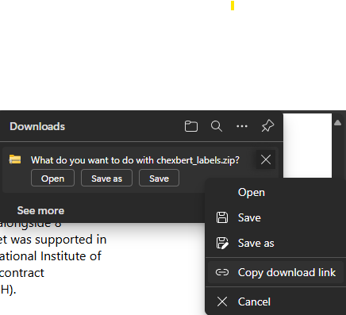

# Chest X-ray Diagnosis and Automated Radiology Report Generation - UDEM PEF-Thesis (Fall-2025)

## [Project options](https://drive.google.com/file/d/1RG4J-OJZHEcZ6JLumfA0csCI9Gp2dGzf/view?usp=sharing)


## [Option chosen](https://drive.google.com/file/d/1Gd5-31rOAuWlL_81S1IRSGc9QBF8aOPb/view?usp=sharing)


## [Simple workflow](https://drive.google.com/file/d/1NbkvJL-v_InbMioPg1pficEe3plhqRi1/view?usp=sharing)

## [Research info](https://github.com/devMuniz02/Chest-X-ray-Diagnosis-Automated-Reporting-using-CNNs-and-LLMs---UDEM-PEF-Thesis-Fall-2025/wiki)

## References of theory
- Attention for Transformers
    - [First attention paper](https://arxiv.org/abs/1409.0473)
    - [First transformer paper](https://arxiv.org/abs/1706.03762)
    - [First GPT model OpenAi](https://cdn.openai.com/research-covers/language-unsupervised/language_understanding_paper.pdf)
    - [GPT-2 model OpenAi](https://cdn.openai.com/better-language-models/language_models_are_unsupervised_multitask_learners.pdf)
      - [GPT-2 Model architecture](https://medium.com/%40hsinhungw/gpt-2-detailed-model-architecture-6b1aad33d16b)
      
        
- Model architectures
  - Convolutional Neural Networks
    - [ResNet](https://arxiv.org/abs/1512.03385)
    - [UNet](https://arxiv.org/abs/1505.04597)
- Techniques
  - Transfer learning
  - Visual explanations
      - [Grad-CAM](https://arxiv.org/pdf/1610.02391)
      - [Grad-CAM++](https://arxiv.org/pdf/1710.11063)

## Things to watch when trainning NN
- Class imbalances
  - Test set and validation
  - Trainning class weights
- Data filtration
  - Same patient ID on same set (Train/Val/Test)


Perfect — here’s the **extended and polished version** of your `.md` section, now including both **CheXpertPlus** and **MIMIC-CXR** datasets, along with preprocessing instructions for the `.csv` file. Everything follows consistent Markdown hierarchy and professional technical-writing standards for research reproducibility:

---

## How to Continue, Contribute, or Replicate Results

### Datasets

This project uses two publicly available medical imaging datasets: **CheXpertPlus** and **MIMIC-CXR**.
Both datasets are designed for chest X-ray research and can be used for multimodal training (image + report).

---

#### 🩻 1. CheXpertPlus Dataset

1. Visit the [Stanford AIMI CheXpertPlus dataset page](https://stanfordaimi.azurewebsites.net/datasets/5158c524-d3ab-4e02-96e9-6ee9efc110a1).

2. Log in with your institutional or personal account.

3. Download the `.csv` metadata file and all **PNG** chunks.
   You can obtain a direct download link by **right-clicking the file’s download button** before downloading, as shown below:

   

4. Use **AzCopy** to download the dataset from the terminal:

   ```bash
   # Create the destination folder if it doesn't exist
   mkdir -p Datasets/CheXpertPlus

   # Download the blob from Azure Storage
   azcopy copy \
     "PASTE_THE_FULL_DOWNLOAD_LINK_HERE" \
     "Datasets/CheXpertPlus/" \
     --recursive=false
   ```

5. After downloading all PNG chunks, extract them into the following structure:

   ```
   Datasets/
   └── CheXpertPlus/
       ├── PNG/
       │   ├── train/
       │   └── valid/
       └── df_chexpert_plus_240401.csv
   ```

---

#### 🩺 2. MIMIC-CXR Dataset

1. Request access to **MIMIC-CXR v2.0.0** through **PhysioNet**:
   [https://physionet.org/content/mimic-cxr-jpg/2.0.0/](https://physionet.org/content/mimic-cxr-jpg/2.0.0/)

2. Once your credentialed access is approved:

   * Download the image files (`.jpg` or `.dcm` format).
   * Download the **MIMIC-CXR-JPG metadata files**, including `mimic-cxr-2.0.0-metadata.csv` and `mimic-cxr-2.0.0-chexpert.csv`.

3. Organize your local folders as follows:

   ```
   Datasets/
   └── MIMIC-CXR/
       ├── images/
       │   ├── p10/
       │   ├── p11/
       │   └── ...
       ├── mimic-cxr-2.0.0-metadata.csv
       └── mimic-cxr-2.0.0-chexpert.csv
   ```
